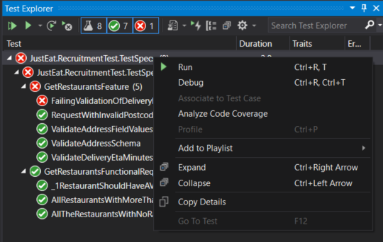

# Just Eat Test Automation Engineer Recruitment Test

## Prequisites
- Visual Studio 2019 (other versions may be compatible but have not been tested)
- .NET Framework 4.8

## Recommended Visual Studio Extensions
- SpecFlow for Visual Studio 2019

## How to use
- Extract all files into a local folder
- Open `JustEat.RecruitmentTest.TestSpecs.sln` in Visual Studio
- Build solution to allow NuGet packages to install

### Solution overview
There are two projects within the solution:

#### JustEat.RecruitmentTest.TestSpecs
This project contains the feature files, step definitions, test data and hooks. SpecFlow and NUnit 3 are the core frameworks used in this project.

### JustEat.RecruitmentTest.RestClient
This project contains all the REST client related classes including requests, response models, helper utilities etc. The project makes heavy use of RestSharp and Newtonsoft.Json.

### Run tests
The simplest way to run the tests is directly from the Visual Studio Test Explorer window.

## Test details

### Get Restaurants Feature

This feature contains the first technical challenge task (**1**) and the additional tests of my choice (**3**).

#### Validate Address schema
This validates the `Restaurants[n].Address` sub-object against the specified schema. This makes us of a reusable helper method in `JustEat.RecruitmentTest.RestClient.Utils` to validate each Address sub-object of each Resturant and return an list of errors.
Due to the schema provided not specifying whether any fields are required nor that additional fields are not allowed, this test will still pass if any/all specified fields are missing or if new fields are added.

#### Validate Address field values
This test validates the values of the Address sub-object are valid based on my assumption that the string values should not be null or empty and the coordinates are required.

#### Request with invalid postcode string
This is a negative tests that checks a `BadRequest` response status code is returned when a malformed postcode string with special characters is used in the request.

#### Validate DeliveryEtaMinutes schema
This test reuses the helper method I created for the first test against the `DeliveryEtaMinutes` sub-object. 
I created an additional JSON schema `DeliveryEtaMinutesJsonSchema.json` to validate against the response with the assumption that `Approximate` could be a valid integer or null, `RangeLower` and `RangeUpper` were required and additional fields were not allowed.

#### Failing validation of DeliveryEtaMinutes schema
This was an additional test I created to demonstrate a failing test and the validation errors that are logged when this happens. I validate this against a modified version of the schema `IncorrectDeliveryEtaMinutesJsonSchema.json` with the null type removed from the `Approximate` field.

### Get Restaurants Functional Requirements
I interpreted task **2** as verifying all of the specified functional requirements with a single request only. I used the SpecFlow `[BeforeFeature]` binding scoped to the feature tag `singleRequest` on a static method to ensure one request was made and all tests were able to access the response to verify the requirements as seperate tests.

## LivingDoc report
I included a SpecFlow LivingDoc generated test report in [TestReport/JustEatRecruitmentTestReport.html](TestReport/JustEatRecruitmentTestReport.html) that allows sharing of a the test features and test results in a single .html file. I've found this to be a excellent way of sharing test details with stakeholders who may not have access to test build systems.

## Answers to technical questions
The answers to the techincal questions can be found [here](AnswersToTechnicalQuestions.md).